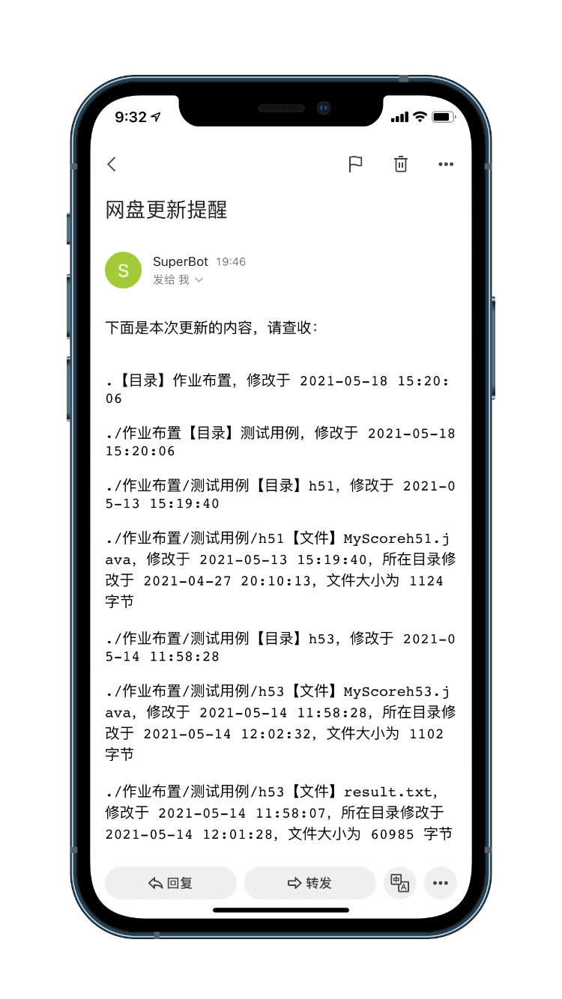
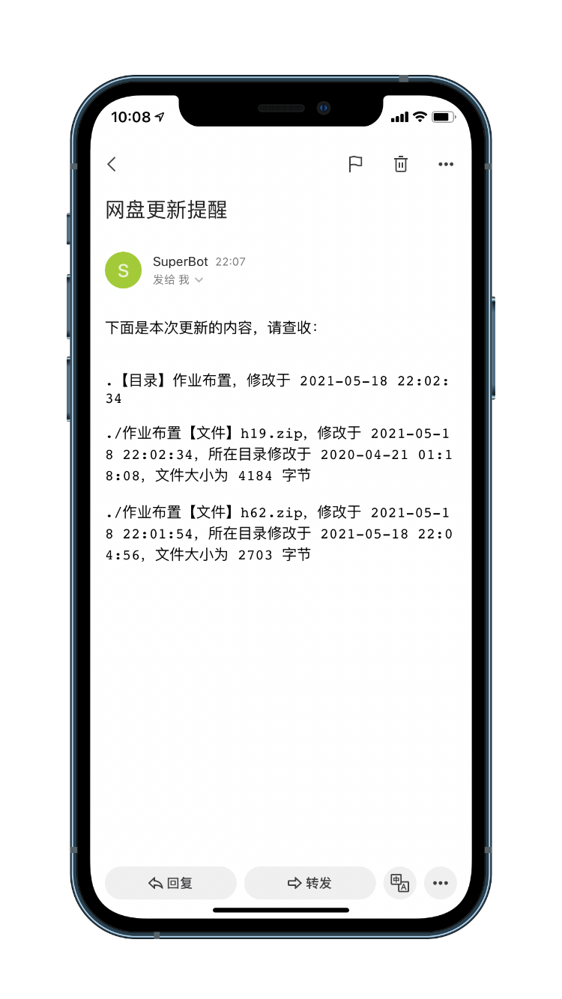

<p align="center">
  <h1 align="center"> TJU-Drive-Crawling </h1>
  <p align="center">
    实时获取 TJU 云盘内容更新提醒
    <br />
    <a href="https://github.com/SuperPung/TJU-Drive-Crawling">关于更多»</a>
    <br />
    <br />
    <a href="https://github.com/SuperPung/TJU-Drive-Crawling">查看Demo</a>
    ·
    <a href="https://github.com/SuperPung/TJU-Drive-Crawling/issues">报告Bug</a>
    ·
    <a href="https://github.com/SuperPung/TJU-Drive-Crawling/issues">提出新特性</a>
  </p>
</p>

<!-- PROJECT SHIELDS -->

[![Contributors][contributors-shield]][contributors-url]
[![Forks][forks-shield]][forks-url]
[![Stargazers][stars-shield]][stars-url]
[![Issues][issues-shield]][issues-url]
[![MIT License][license-shield]][license-url]

<!-- PROJECT LOGO -->


老师留作业、发资料用天大云盘？经常输入链接、填入密码后，发现内容没有更新？来部署 TJU-Drive-Crawling 吧！实时获取 TJU 云盘内容更新提醒！

## 目录

- [特性](#特性)
- [开始](#开始)
	- [配置要求](#配置要求)
	- [安装步骤](#安装步骤)
	- [用法](#用法)
- [文件目录说明](#文件目录说明)
- [开发的架构](#开发的架构)
- [部署](#部署)
	- [部署至服务器](#部署至服务器)
- [使用到的框架](#使用到的框架)
- [TODO](#TODO)
- [贡献者](#贡献者)
	- [如何参与开源项目](#如何参与开源项目)
- [版本控制](#版本控制)
- [作者](#作者)
- [版权说明](#版权说明)
- [鸣谢](#鸣谢)


### 特性

实时获取 TJU 云盘内容更新提醒：






### 开始

#### 配置要求

- 需要 Python 3 环境
- 需要 pip3，以及 requests

#### 安装步骤

1. 克隆本仓库到本地文件夹：

	```sh
	git clone https://github.com/SuperPung/TJU-Drive-Crawling.git
	```
	
2. 在与 `main.py` 同级目录下，新建 `conf.py`，添加以下内容：

	```python
	class Config:
	    tju_pan_url = 'http://pan.tju.edu.cn/#/link/XXXXXXXXXXXXXXXXXXXXXXXXXXXXXX'
	    password = 'XxxX'
	
	    mail_host = "smtp.xxx.com"
	    mail_user = "sender@xxx.com"
	    mail_pass = "XXXXXXXXXXXXXXXX"
	
	    sender = 'sender@xxx.com'
	    receiver = 'receiver@xxx.com'
	    from_name = 'sender'
	```

	字段解释：

	- `tju_pan_url`：要监控的 TJU 云盘 URL，前面是否包含端口、是否包含 `/#/` 等不影响效果。
	- `password`：和上面 URL 对应的密码，大小写不敏感。
	- `mail_host`：发信人邮箱的主机地址。
	- `mail_user`：发信人用户名，可以是邮箱。
	- `mail_pass`：发信人邮箱密码，一般是授权码。
	- `sender`：发信人邮箱。
	- `receiver`：收信人（你）的邮箱。
	- `from_name`：发信人昵称。

#### 用法

运行 `main.py`：

```sh
python3 main.py
```

首次运行会创建 `json` 文件夹和 `root.json` 文件，默认当前时刻云盘内容均为新添加，更新 `root.json` 文件，发送邮件。


### 文件目录说明

```
TJU-Drive-Crawling
├─ README.md	# 说明
├─ __pycache__	# 缓存
├─ json
│  └─ root.json	# 云盘内容缓存
├─ .gitignore
├─ LICENSE	# 版权
├─ main.py	# 主文件
└─ conf.py	# 配置文件

```


### 开发的架构 

暂无


### 部署

#### 部署至服务器

1. 克隆本仓库到服务器目录，添加 `conf.py` 如上；

2. 新建 `cron.sh` 为执行脚本：

	```sh
	#!/bin/bash
	# author: super
	
	cd /path/to/TJU-Drive-Crawling
	python3 main.py > auto.log
	```

3. 新建 `cron` 为 crontab 文件：

	```sh
	*/1 * * * * /path/to/TJU-Drive-Crawling/cron.sh
	```

	其中，`*/1 * * * *` 为每隔一分钟执行一次，可以调整频率。

4. 运行：

	```sh
	crontab cron
	```

	添加到 crontab。

5. 运行：

	```sh
	crontab -l
	```

	可以列出所有 crontab 任务。

6. 检测成功与否：可以通过手动上传文件至云盘，检查是否收到邮件、`auto.log` 文件是否更新等。


### 使用到的框架

暂无


### TODO

- [x] 云盘内容更新时邮件提醒
- [x] 支持部署至服务器
- [ ] 支持部署至其他平台
- [ ] 邮件内容展示优化


### 贡献者

[me](https://github.com/SuperPung)

#### 如何参与开源项目

贡献使开源社区成为一个学习、激励和创造的绝佳场所。你所作的任何贡献都是**非常感谢**的。


1. Fork the Project
2. Create your Feature Branch (`git checkout -b feature/AmazingFeature`)
3. Commit your Changes (`git commit -m 'Add some AmazingFeature'`)
4. Push to the Branch (`git push origin feature/AmazingFeature`)
5. Open a Pull Request


### 版本控制

该项目使用 Git 进行版本管理。您可以在 repository 参看当前可用版本。


### 作者

[SUPER](https://github.com/SuperPung)@[SuperPung](https://blog.superpung.xyz)


### 版权说明

该项目签署了 GPL-3.0 授权许可，详情请参阅 [LICENSE](https://github.com/SuperPung/TJU-Drive-Crawling/blob/master/LICENSE)


### 鸣谢


- [JetBrains](https://www.jetbrains.com)
- [Aliyun](https://www.aliyun.com)
- [GitHub Emoji Cheat Sheet](https://www.webpagefx.com/tools/emoji-cheat-sheet)
- [Img Shields](https://shields.io)
- [Choose an Open Source License](https://choosealicense.com)


<!-- links -->

[your-project-path]:SuperPung/TJU-Drive-Crawling
[contributors-shield]: https://img.shields.io/github/contributors/SuperPung/TJU-Drive-Crawling.svg?style=flat-square
[contributors-url]: https://github.com/SuperPung/TJU-Drive-Crawling/graphs/contributors
[forks-shield]: https://img.shields.io/github/forks/SuperPung/TJU-Drive-Crawling.svg?style=flat-square
[forks-url]: https://github.com/SuperPung/TJU-Drive-Crawling/network/members
[stars-shield]: https://img.shields.io/github/stars/SuperPung/TJU-Drive-Crawling.svg?style=flat-square
[stars-url]: https://github.com/SuperPung/TJU-Drive-Crawling/stargazers
[issues-shield]: https://img.shields.io/github/issues/SuperPung/TJU-Drive-Crawling.svg?style=flat-square
[issues-url]: https://img.shields.io/github/issues/SuperPung/TJU-Drive-Crawling.svg
[license-shield]: https://img.shields.io/github/license/SuperPung/TJU-Drive-Crawling?style=flat-square
[license-url]: https://github.com/SuperPung/TJU-Drive-Crawling/blob/master/LICENSE
